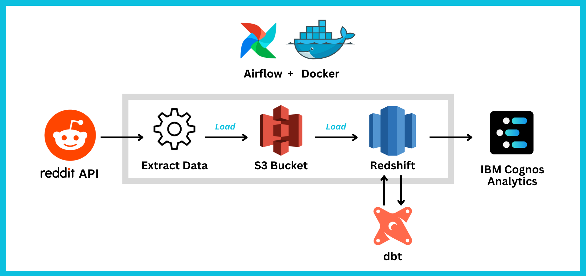
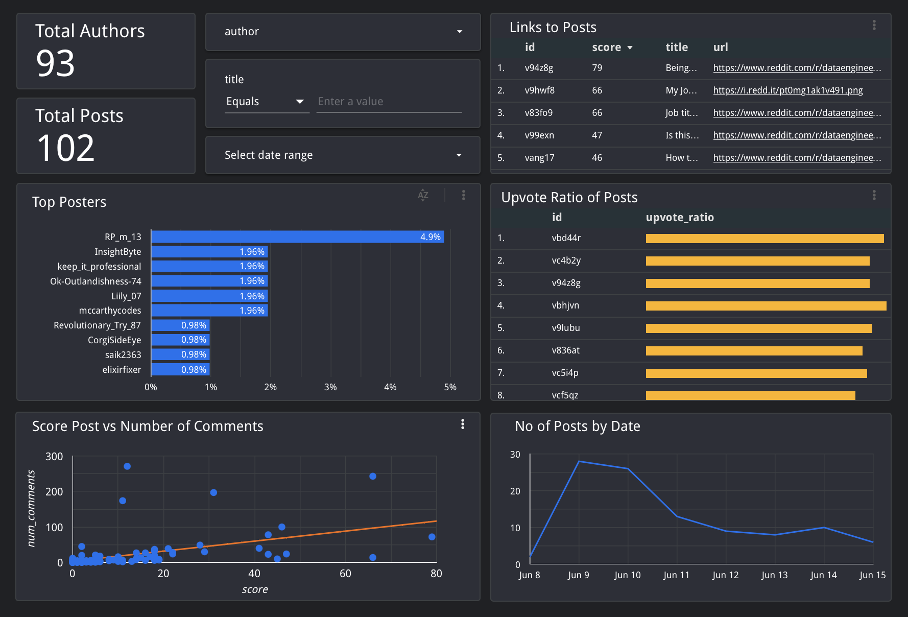

# Reddit ETL Pipeline

A data pipeline to extract Reddit data from [r/dataengineering](https://www.reddit.com/r/dataengineering/).

Output is a Google Data Studio report, providing insight into the Data Engineering official subreddit.

## Motivation

Project was based on an interest in Data Engineering and the types of Q&A found on the official subreddit. 

It also provided a good opportunity to develop skills and experience in a range of tools. As such, project is more complex than required, utilising dbt, airflow, docker and cloud based storage.

## Architecture

1. Extract data using [Reddit API](https://www.reddit.com/dev/api/)
1. Load into [AWS S3](https://aws.amazon.com/s3/)
1. Copy into [AWS Redshift](https://aws.amazon.com/redshift/)
1. Transform using [dbt](https://www.getdbt.com)
1. Create [PowerBI](https://powerbi.microsoft.com/en-gb/) or [IBM Cognos Analytic](https://www.ibm.com/products/cognos-analytics) Dashboard 
1. Orchestrate with [Airflow](https://airflow.apache.org) in [Docker](https://www.docker.com)

## Output

* Final output from Google Data Studio. Link [here](https://datastudio.google.com/reporting/e927fef6-b605-421c-ae29-89a66e11ea18). Note that Dashboard is reading from a static CSV output from Redshift. Redshift database was deleted so as not to incur cost.

## Setup

Follow below steps to setup pipeline. I've tried to explain steps where I can. Feel free to make improvements/changes. 

As AWS offer a free tier, this shouldn't cost you anything unless you amend the pipeline to extract large amounts of data, or keep infrastructure running for 2+ months. However, please check [AWS free tier](https://aws.amazon.com/free/?all-free-tier.sort-by=item.additionalFields.SortRank&all-free-tier.sort-order=asc&awsf.Free%20Tier%20Types=*all&awsf.Free%20Tier%20Categories=*all) limits, as this may change.
